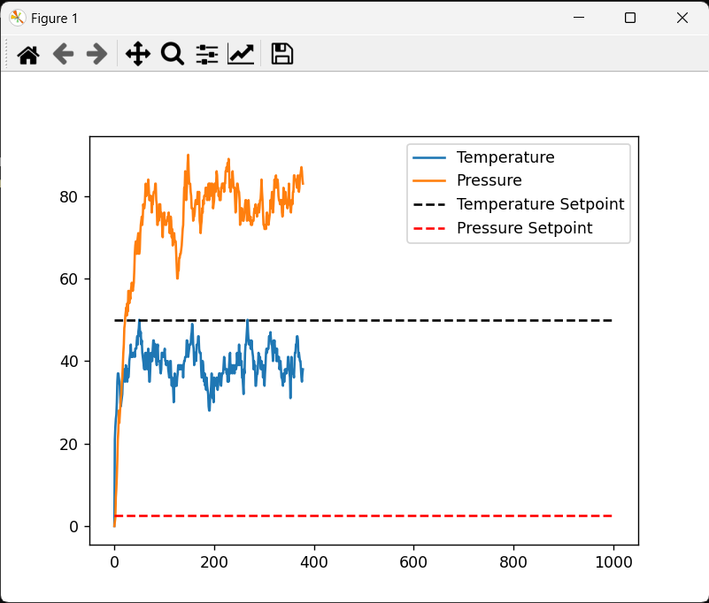

# Coding Assignment  

Sensor Input and Control System Simulation

## Objective:

Your task is to develop a simulation for a Sensor Input and Control System in a nanolithography machine. The system should be able to manage and respond to sensor inputs in real-time, adjusting machine parameters as necessary to maintain optimal conditions.

## Setup Instructions

1. Install the latest version of Python from [the official website](https://www.python.org/downloads/).

2. Install a C++ compiler. If you're using Windows, you can install [MinGW](http://www.mingw.org/). If you're using macOS, you can install the Xcode command line tools. If you're using Linux, you can install the `g++` package using your package manager.

3. Clone this repository to your local machine using `git clone https://github.com/your-username/your-repository.git`.

4. Navigate to the directory where you cloned the repository.

5. Create the Shared library using `g++ -m64 -shared -o control_system.dll control_system.cpp -lpthread`.

6. Run the python file using `python control_system.py`

You should see the following graph showing the real-time simulated temperature and pressure values of the system. However, as you can see, as there is no control system implemented yet, the temperature and pressure values are not being controlled.

## Requirements:

### C++ Component 

Develop the core simulation engine in C++.

- You are provided a starting point in the file `control_system.cpp`. You may modify this file as necessary, or add new files depending on your solution.

- Implement real-time control mechanisms to adjust machine parameters based on sensor inputs. A skeleton implementation of a PID controller is provided in the file `control_system.cpp`. Add the functionality in the `control()` function to implement the PID controller.

### Python Component

Develop a Python interface for the simulation engine.

- You are provided a starting point in the file `control_system.py`. You may modify this file as necessary, or add new files depending on your solution.

- Provide functions to start, stop, and pause the simulation.

- Allow the user to set the parameters for the system (e.g., target temperature, target pressure).

- Display real-time updates of the sensor readings and machine parameters during the simulation.

- Use data visualization libraries to plot key sensor readings and machine parameters over time.

## Evaluation Criteria

Your solution will be evaluated on the following criteria:

- Correctness and completeness of the simulation.

- Use of object-oriented principles in the design of the simulation engine.

- Efficiency of the real-time control mechanisms.

- Usability and functionality of the Python interface.

- Quality of the code (including readability, comments, and adherence to coding standards).

- Handling of potential errors or exceptional conditions in the system.

## Submission Instructions

1. Fork this repository to your own GitHub account and make the forked repository private.

2. Clone the forked repository to your local machine.

3. Commit your changes to a new branch with the name `solution-yourname`, replacing `yourname` with your name.

4. Push your branch to the repository using `git push origin solution-yourname`.

5. In your private repository, open a pull request from your branch to the `main` branch.

6. In the pull request description, provide a brief explanation of your solution and any decisions you made while developing it.

7. Finally, add the use of this repository as a collaborator to your private repository so that we can review your solution.

Please note: Do not open a pull request in the original public repository. Your solution should be submitted in your private repository only.

Please submit your complete code files along with a README that explains how to run your simulation. Include any assumptions or design decisions you made while developing the simulation.
